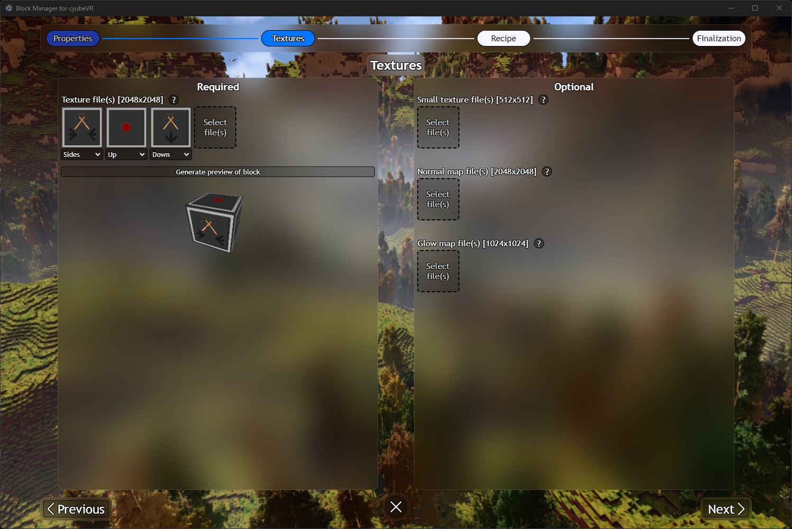
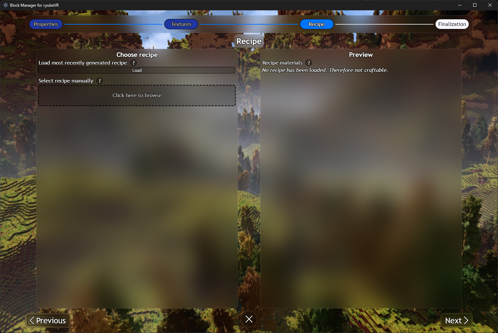
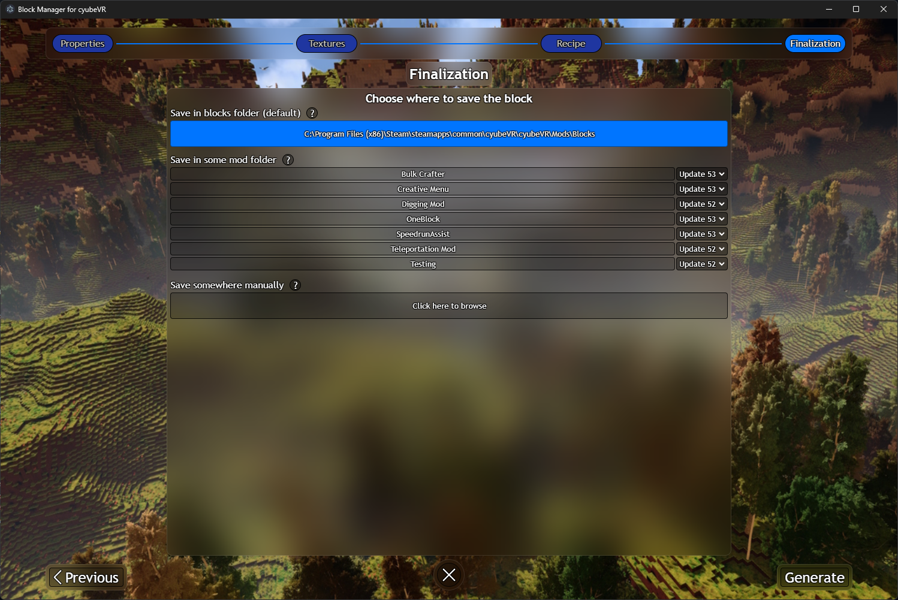

# BlockManager
This application can be used to manage all of your cyubeVR custom blocks, as well as easily create new ones when given some textures.

# How to use
There are two main parts of the application - the "Manage Blocks" window and the "Block Generator" window. When starting the application 
you will be greeted with the first of the two.
## Manage Blocks window
If you have never made any custom blocks, then you will not see much here. In my case, because I have made quite a few custom blocks, it looks
like this:

Here you can see an overview of the names and IDs of the blocks. If you click any of them you will be able to expand their view, where you
can see more detailed information about the block as well as a preview. You can also choose to edit or delete the block:

You are also able to search for a block, sort by name or ID, and filter by independent blocks/blocks from mods.

If you ever edit a block then it will just open the Block Generator window with all values already there, and then you can just save 
the changes by going to the Finalization step.

Additionally, to open the Block Generator window to create a new custom block, click the + button at the bottom.

## Block Generator window
Next up we have the Block Generator window. This is where you will create new blocks from scratch using some textures that
you have made, as well as specify the recipe and all other details.

Block generation is split up into four parts: Properties, Textures, Recipe and Finalization. Let's go through each of them.
### Properties
Here you have to fill out the properties of the block that you want to make. This means the name of the block, your name, an ID,
and much more. It looks like this:

There are both Required and Optional properties. To read more about each of them, simply hover over the question mark next to
each field.

### Textures
The textures part is pretty self-explanatory. Simply select the textures that you want your block to have. It looks like this
when no textures have been selected:

And like this when 3 textures have been given and after the "Generate preview of block" button has been pressed:

Here there are also both Required and Optional textures that you can provide. Hover over the question mark to read more about
each type of texture.

### Recipe
For the recipe you have to provide a file specifying what blocks to use.
If you use the in-game recipe generator button, then you can simply press the "Load most recently generated recipe" button and the recipe materials to the right should update accordingly.

The recipe part looks like this:

### Finalization
Lastly we have the finalization. This is just where you specify where to save the block - you can either save it as an independent
block or as part of a mod. It looks like this:

If you want the block to be part of a mod, then choose the mod and the version that the mod is made for.
